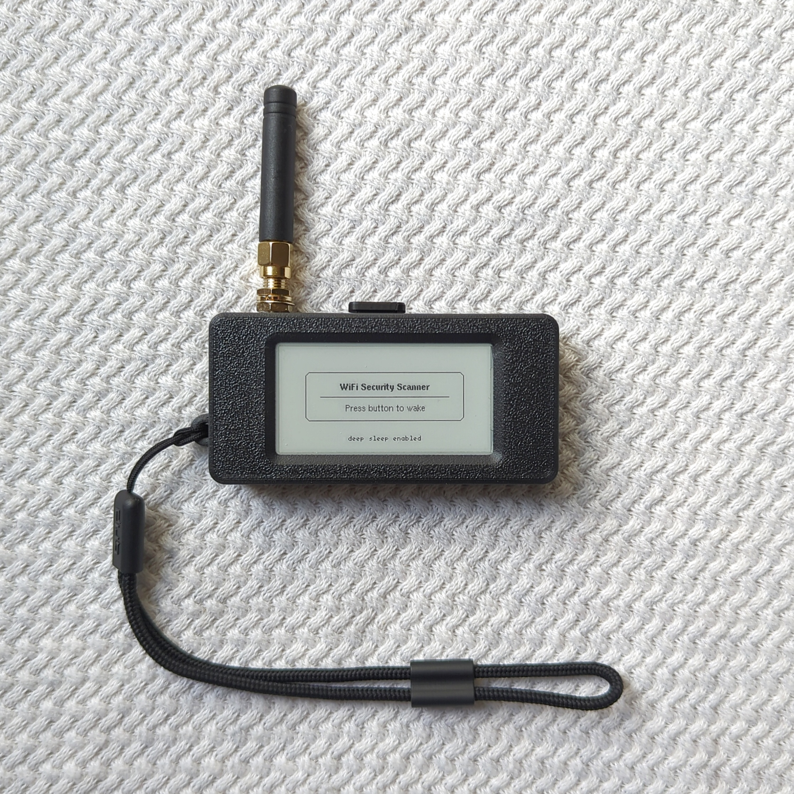
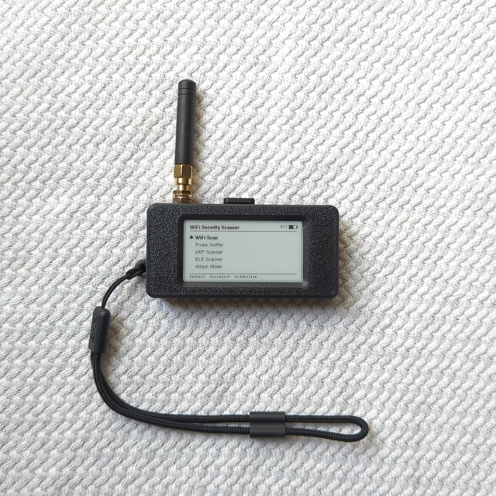
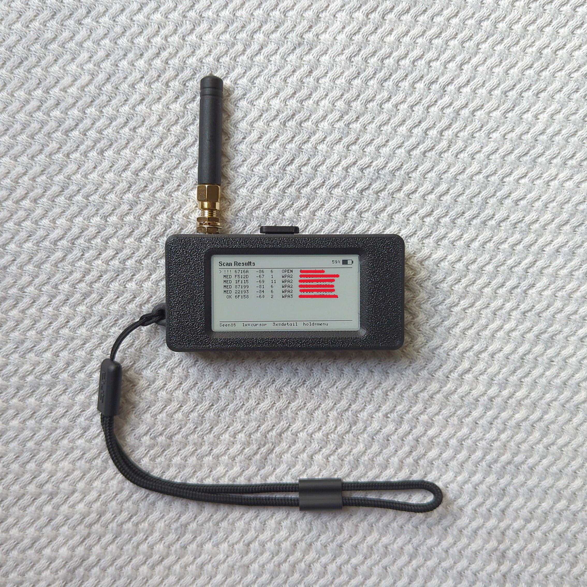
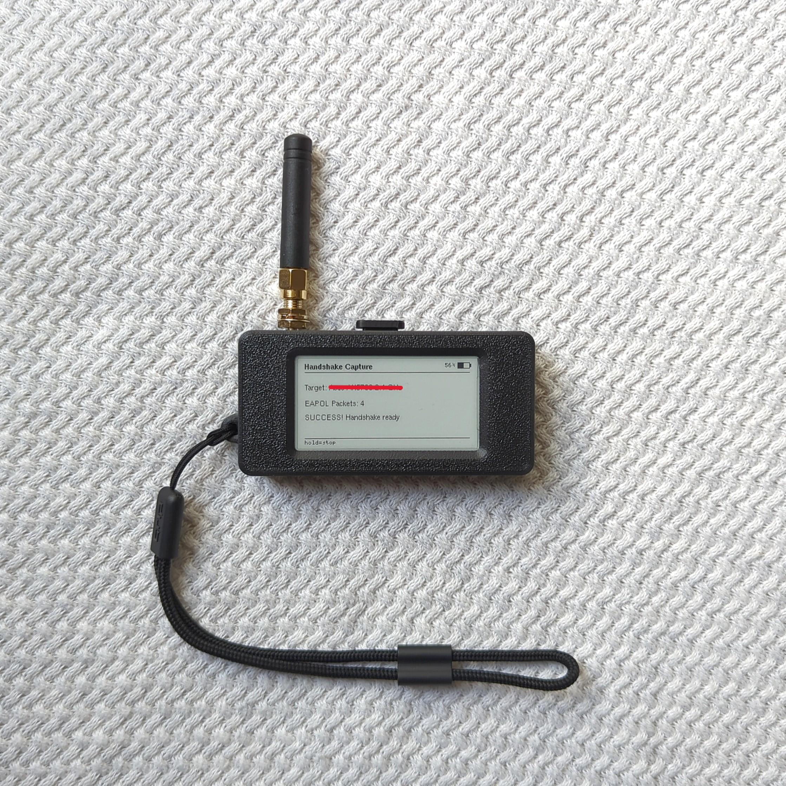
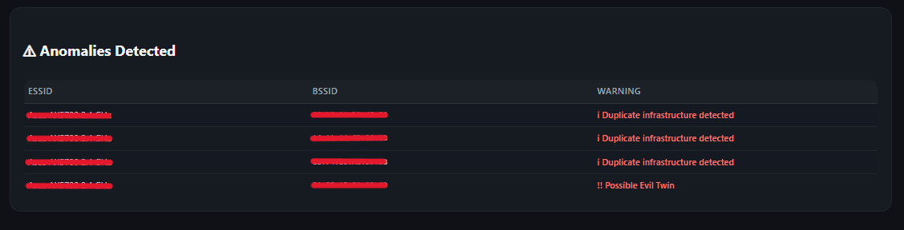
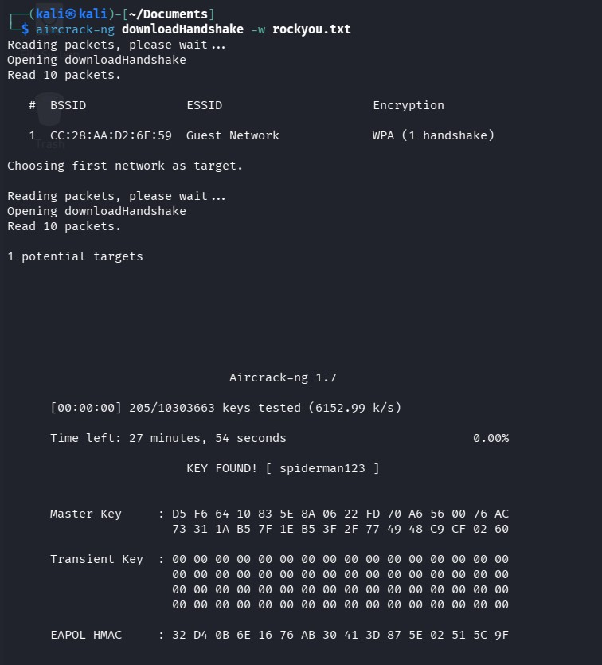
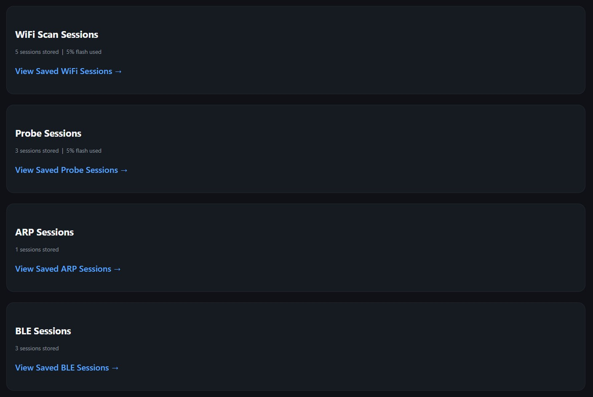

# WiFi Security Scanner

A portable wireless security assessment and monitoring platform built around the **Heltec Wireless Paper V1.2 (ESP32-S3 + SX1262)**.

The scanner combines Wi-Fi infrastructure discovery, probe-request telemetry, anomaly detection, ARP monitoring, BLE/GATT inspection, session logging, a local web report and controlled Wi-Fi security testing capabilities.

 
 

> **Authorized use only**
>
> This project is intended for educational purposes, security research and networks/devices that you own or have explicit permission to test.
> Active wireless testing features must only be used in controlled environments.

---

## Features

### Wi-Fi Infrastructure Scanning

- Wi-Fi network discovery using the ESP32 Wi-Fi scan API
- Displays ESSID, BSSID, PWR, CH, MB, ENC, CIPHER and AUTH
- Risk classification: LOW / MEDIUM / HIGH / CRITICAL
- Scrollable summary list with cursor navigation
- Detail view per network
- Historical database tracking up to 200 unique BSSIDs across scans
- Background auto-scan every 20 seconds
- Network sighting counters
- Authentication-change detection
- Channel-shift detection
- BSSID rotation detection
- Possible duplicate / evil-twin infrastructure detection
- Persistent scan sessions

  
### Anomaly Detection

The scanner tracks changes between observations and flags potentially suspicious network behaviour, including:

- Possible evil-twin / duplicate infrastructure
- Authentication changes
- BSSID rotation
- Channel changes
- Duplicate SSIDs

These are **heuristic indicators**, not proof of malicious activity. Findings should be investigated in context.

| Flag | Severity | Description |
|---|---|---|
| Possible Evil Twin | !! | Network sharing an ESSID with conflicting authentication settings |
| Auth mode changed | ! | Network security type changed between scans |
| Channel shift | ! | Network moved channels between scans |
| Duplicate SSID | i | Multiple networks sharing the same name |
| Duplicate infrastructure | i | Multiple BSSIDs for the same ESSID, which can be normal for mesh networks or extenders |

### Probe Request Telemetry

The scanner can monitor 802.11 probe requests using ESP32 promiscuous mode.

Features include:

- Passive 802.11 probe request capture
- Up to 500 stored probe entries
- Wildcard `<any>` probe tracking
- Client MAC tracking
- Randomized MAC detection
- First/last seen timestamps
- Probe frequency counters
- Adaptive channel surveying
- High-density channel prioritization
- Persistent probe sessions
- Up to 200 stored probe sessions
- Client grouping in the web report
- Probe density statistics

Probe telemetry can provide insight into client RF activity and previously requested network names.

Before entering capture mode, the scanner performs a channel survey that scores channels by AP density and RSSI, then focuses on the busiest channels using adaptive dwell times.

> Probe telemetry is observational only. The scanner does not associate with or respond to devices during probe capture.

### ARP Scanner

The scanner includes an ARP monitoring mode for **authorized Wi-Fi networks**.

Workflow:

1. Configure the target Wi-Fi network through the scanner's configuration interface.
2. Connect to the authorized network.
3. Monitor ARP activity.
4. Store ARP scan/session information.
5. Review the results through the device interface and web report.

> **Only use this mode on networks you own or have explicit permission to assess.**

### BLE Scanner & GATT Inspection

The BLE subsystem provides:

- BLE device discovery
- Device address tracking
- RSSI information
- Device name/service information
- Connectable-device detection
- GATT service discovery
- Characteristic inspection
- Characteristic read capability detection
- Persistent BLE sessions

The scanner can actively connect to selected BLE devices for GATT inspection.

> **BLE connections and GATT operations should only be performed against devices you own or are explicitly authorized to test.**

### Wi-Fi Security Testing / EAPOL Capture

The firmware also contains an **Attack Mode / Handshake Capture** feature for controlled wireless security testing.

It can:

- Select a target network
- Perform controlled deauthentication testing
- Monitor for EAPOL exchanges
- Store captured traffic as PCAP
- Save capture metadata to flash storage
- Make captures available through the web report

Captured EAPOL exchanges can be exported as PCAP files and independently examined using tools such as Wireshark or Kali Linux.

> **This functionality is strictly intended for isolated lab networks and authorized security testing. Do not use it against networks or devices without permission.**

The firmware records the capture; external tools should be used to determine whether the resulting EAPOL exchange is sufficient for further analysis.

---

## Session Storage

Scan sessions and probe sessions are saved independently to flash (LittleFS) as ring buffers.

| Store | Capacity | Format |
|---|---|---|
| WiFi sessions | 200 sessions | `/sessions/s000.csv` |
| Probe sessions | 200 sessions | `/probes/p000.csv` |

The firmware also maintains persistent session data for ARP, BLE, and handshake captures.

Sessions can be cleared from the **Scan Sessions** screen.

Flash usage is shown on both the device screen and in the web report.

---

## Web Report

When **Web Report** is selected from the menu:

1. The device creates a WiFi access point.
2. Connect your phone or laptop:
   - SSID: `WiFi-Security-Scanner`
   - Password: `SetYourOwnPassword`
3. Open a browser and go to `http://192.168.4.1`.
4. The collected Wi-Fi information is shown in an airodump-ng style table.
5. If anomalies are detected, a dedicated **Anomalies Detected** section appears below the table.
6. Probe requests are shown grouped by client device, sorted by number of known networks.
7. ARP results, BLE devices, handshake captures, and session information are also available.
8. CSV export links allow Wi-Fi and probe data to be downloaded.

> **Note:** Change `AP_SSID` and `AP_PASS` at the top of `HeltecWifiScanner.ino` before uploading to set your own network name and password.

### Current Web Interface

The current implementation uses **HTTP rather than HTTPS**.

Because the report can contain sensitive wireless assessment information, the interface should be used within the scanner's local access point / authorized environment rather than exposed to an untrusted network.

---

## Button Controls

| Screen | 1x click | 2x click | 3x click | Hold |
|---|---|---|---|---|
| Menu | Next item | Select | — | Sleep |
| Results | Cursor ↓ | Next page | Detail view | Menu |
| Detail | Back | — | — | Menu |
| Sessions | — | — | Clear all | Menu |
| Probe Sniffer | — | — | — | Stop & menu |
| Web Report | — | — | — | Stop & menu |

---

## Technical Notes & Limitations

- **2.4GHz only** - the ESP32-S3 radio does not support 5GHz. Networks broadcasting exclusively on 5GHz will not appear.
- **MB is estimated** - link rate is inferred from available scan information rather than directly measured from beacon frames.
- **Named probe counts are environment dependent** - modern devices with MAC randomization and wildcard probing can show high total frame counts but low named probe counts. This is expected behaviour.
- **Probe data is not correlated across sessions** - randomized MACs make cross-session device tracking unreliable by design.
- **Anomaly detection is heuristic** - a detected anomaly does not necessarily mean an attack is occurring.
- **BLE advertised connectability does not guarantee unauthenticated access** - the scanner identifies advertised BLE connectivity, while actual access depends on the device's implementation and security configuration.
- **EAPOL capture does not by itself prove a complete handshake** - captured traffic should be independently examined with appropriate analysis tools.
- **HTTP only** - the current web interface does not provide TLS/HTTPS.
- **Wireless observations depend on RF conditions** - range, interference, channel activity, antenna characteristics, and device behaviour can affect results.

---

## Hardware

| Component | Details |
|---|---|
| Board | Heltec Wireless Paper V1.2 |
| Chip | ESP32-S3FN8 + SX1262 |
| Display | 250×122 e-ink |
| Button | GPIO0 (onboard) |
| Battery | Single cell LiPo 3.7V |

### Where to buy

- **Board** - [Heltec Wireless Paper V1.2 on AliExpress](https://www.aliexpress.com/item/1005005698328124.html)
- **Battery (requires soldering, higher capacity)** - [LiPo battery on AliExpress](https://www.aliexpress.com/item/32956044089.html)
- **Battery (no soldering, lower capacity)** - [LiPo battery on eBay](https://www.ebay.com/itm/184542614624)

> Note: The board listing title may say 212×104 pixels - this is the same board.
> Make sure you select **V1.2** and not V1.1.

---

## Dependencies

Install via Arduino Library Manager:

| Library | Purpose |
|---|---|
| `heltec-eink-modules` | E-ink display driver |
| `Adafruit GFX Library` | Graphics primitives |
| `U8g2_for_Adafruit_GFX` | Font rendering |

---

## Arduino IDE Setup

1. Go to **File → Preferences → Additional Boards Manager URLs** and add:
   `https://github.com/Heltec-Aaron-Lee/WiFi_Kit_series/releases/download/0.0.5/package_heltec_esp32_index.json`
2. Go to **Tools → Board → Boards Manager**, search for **Heltec ESP32 Series Arduino Develop Environment** and install it.
3. Select board: **Heltec Wireless Paper V1.2**
4. Select the appropriate port under **Tools → Port**.
5. Install the three libraries listed above.
6. Open `HeltecWifiScanner.ino`.
7. Configure `AP_SSID` and `AP_PASS` if required.
8. Upload the firmware.

---

## Data Handling & Reliability

The firmware includes several safeguards around stored scan data and generated reports:

- Historical Wi-Fi data is synchronized with current scan results
- Scan sessions store the current scan snapshot
- LittleFS is mounted without automatically formatting the filesystem on mount failure
- Persistent indexes perform validation before being loaded
- HTML output escapes radio-originated strings
- CSV output escapes exported values
- Stored filenames are validated before use
- Session data is bounded to prevent uncontrolled growth

These measures are intended to make the scanner more reliable when handling arbitrary SSIDs, BLE names, probe names, and other data originating from the RF environment.

---

## Intended Use

This project was built as a practical embedded security research platform and learning project.

It demonstrates how an ESP32-S3 can combine:

- Wireless reconnaissance
- RF telemetry
- Network security monitoring
- Anomaly detection
- ARP analysis
- BLE/GATT inspection
- Persistent embedded storage
- PCAP generation
- A local web interface
- E-ink embedded UI
- Battery-powered operation

The goal is to provide a compact platform for experimenting with wireless security concepts without requiring a full-size computer for every task.

---

## Responsible Use

Use this project only against:

- Your own networks
- Your own devices
- Dedicated security-testing laboratories
- Systems for which you have explicit authorization

Do not use active scanning, deauthentication, packet capture, ARP monitoring, BLE connections or other testing functionality against third-party systems without permission.

The author is not responsible for misuse of this project.

---

## Acknowledgements

Adapted from the [Pala One firmware](https://github.com/PaulLagier/pala-one-firmware)
by [Paul Lagier](https://github.com/PaulLagier) - button handling, battery measurement,
and deep sleep patterns. Check out his e-reader project, it is excellent!

---

## Case

The 3D printed case shown in the photos is from the Pala One project by Paul Lagier.

It fits the Heltec Wireless Paper V1.2 perfectly and is available for purchase here:

https://ko-fi.com/s/e14ed892ea

> Please check the specific specifications for the battery size and the printable
> case files to ensure compatibility before purchasing the hardware.
> Paul has a print for every battery mentioned in this project. It only depends
> on the style of the case, size, soldering or capacity.

---

## Author

Robert Russell

---

## License

See [LICENSE](LICENSE) for details.
