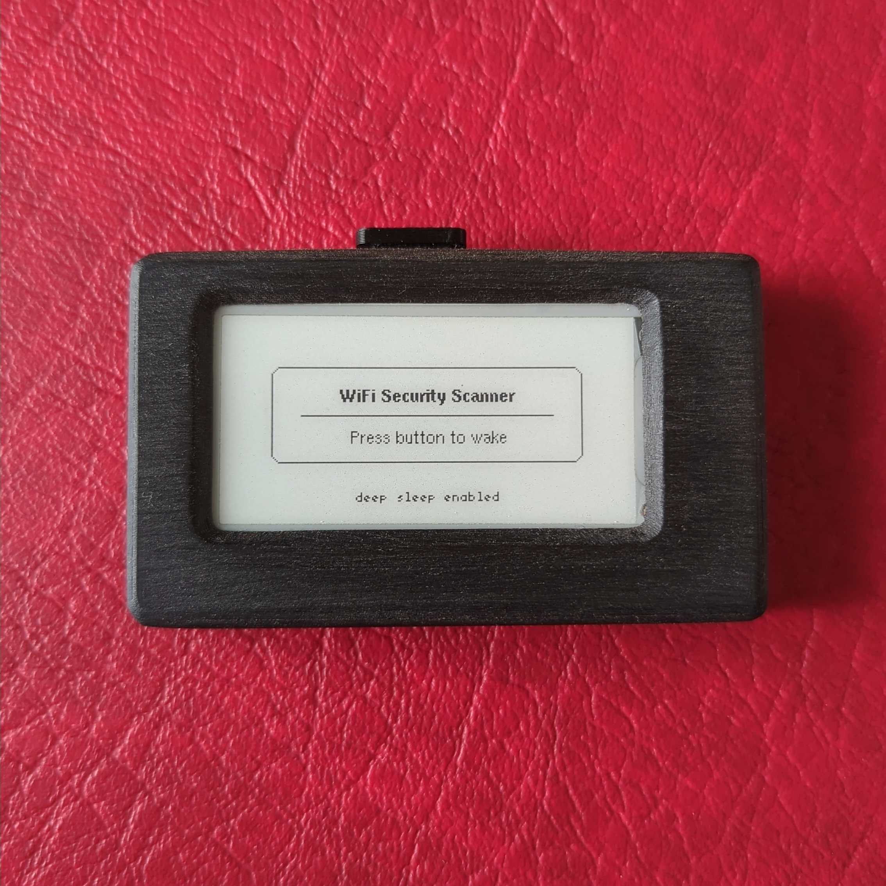
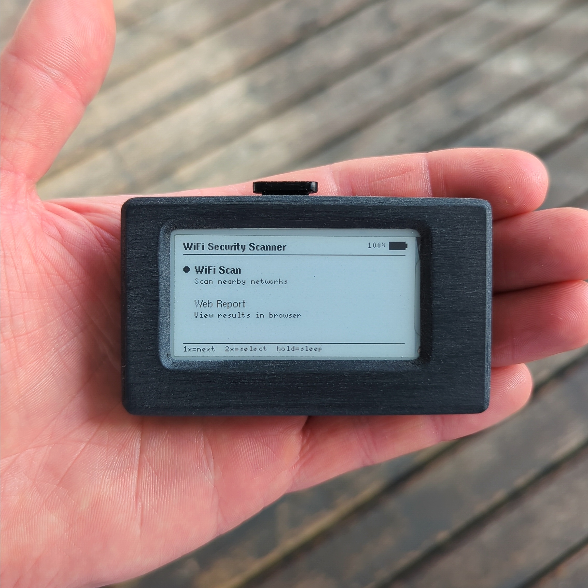
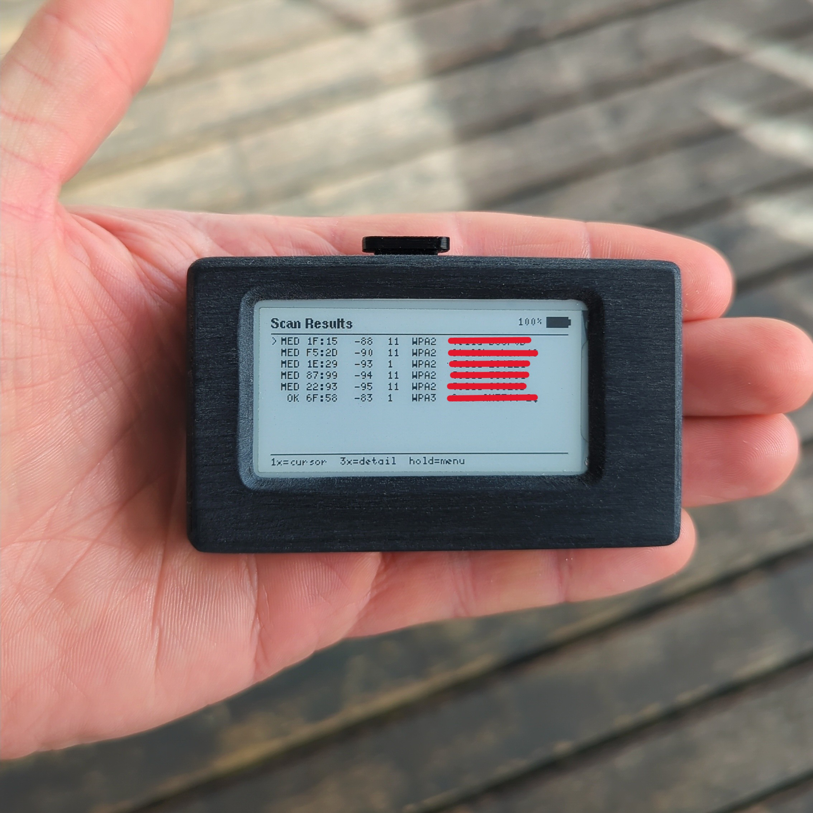
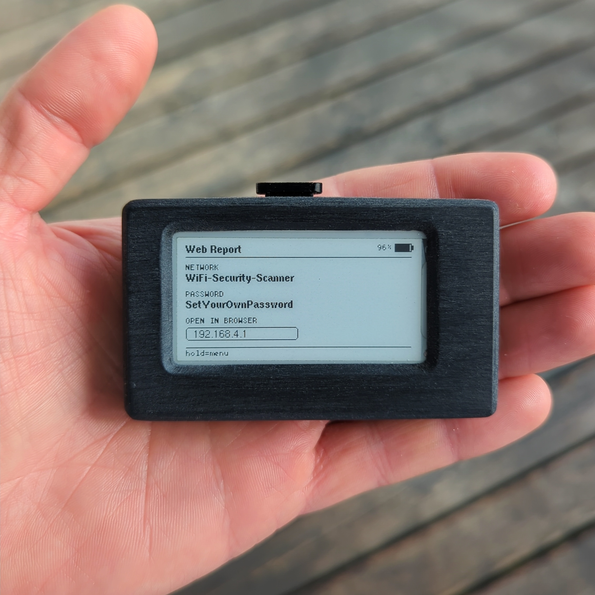
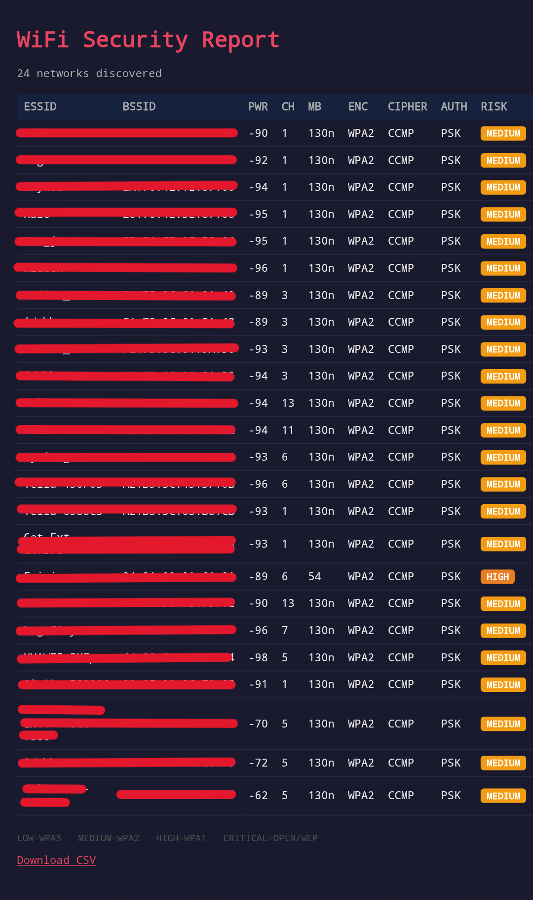
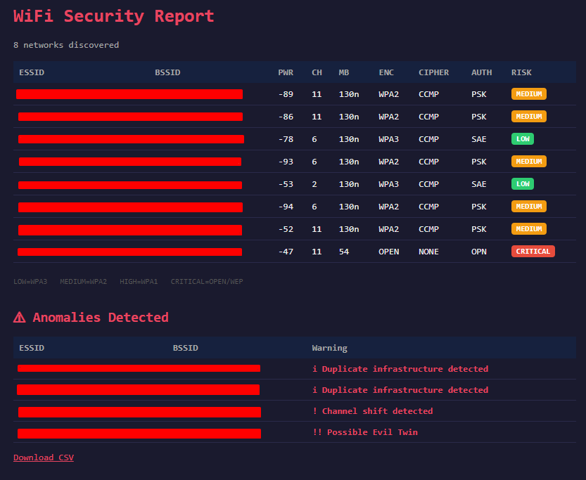

# WiFi Security Scanner

A portable passive WiFi reconnaissance and security auditing platform built on the Heltec Wireless Paper V1.2 (ESP32-S3).
Passively scans nearby networks, classifies them by security risk, detects wireless anomalies such as evil twin access points and generates a full web report with CSV export over its own access point.

 
 

---

## Features

- Passive WiFi scanning - no connection to any network
- Risk classification: LOW / MEDIUM / HIGH / CRITICAL
- Displays ESSID, BSSID, PWR, CH, MB, ENC, CIPHER, AUTH
- Scrollable summary list with cursor navigation
- Detail view per network with first seen timestamp
- Persistent in-memory historical database tracking up to 200 unique BSSIDs across scans
- Background auto-scan every 20 seconds
- Evil twin detection - detects suspicious networks sharing an ESSID with mismatched authentication settings
- Auth change detection - alerts when a network's security type changes between scans
- BSSID rotation detection - identifies duplicate infrastructure or unstable beacon identity
- Channel shift detection - tracks networks moving channels between scans
- Web report at http://192.168.4.1 (airodump-ng style table)
- Anomaly section in web report - highlights suspicious networks in red
- CSV export - download full scan history for offline reporting
- Deep sleep with wake-on-button
- Battery level indicator

---

## Web Report

When **Web Report** is selected from the menu:

1. The device creates a WiFi access point
2. Connect your phone or laptop:
   - SSID: `WiFi-Security-Scanner`
   - Password: `SetYourOwnPassword`
3. Open a browser and go to `http://192.168.4.1`
4. The full scan history is shown in an airodump-ng style table
5. If anomalies are detected, a dedicated **Anomalies Detected** section appears below the table
6. A CSV export link at the bottom lets you download the full scan history

> **Note:** Change `AP_SSID` and `AP_PASS` at the top of `HeltecWifiScanner.ino`
> before uploading to set your own network name and password.

> **Note:** Screenshot captured from a mobile phone browser.

### Anomaly Detection

The scanner passively monitors for suspicious network behaviour across scans:

| Flag | Severity | Description |
|---|---|---|
| Possible Evil Twin | !! | Network sharing an ESSID with conflicting authentication settings |
| Auth mode changed | ! | Network security type changed between scans |
| Channel shift | ! | Network moved channels between scans |
| Duplicate SSID | i | Multiple networks sharing the same name |
| Duplicate infrastructure | i | Multiple BSSIDs for the same ESSID (normal for mesh/extenders) |

---

## Risk Classification

| Risk | Label | Encryption |
|---|---|---|
| 0 | LOW | WPA3, WPA2+WPA3 |
| 1 | MEDIUM | WPA2 |
| 2 | HIGH | WPA1 |
| 3 | CRITICAL | OPEN, WEP |

---

## Technical Notes & Limitations

- **2.4GHz only** - the ESP32-S3 radio does not support 5GHz. Networks broadcasting exclusively on 5GHz will not appear in scan results.
- **MB is estimated** - link rate is inferred from auth mode, not read directly from beacon frames.
- **Historical database resets on reboot** - accumulated scan data is stored in RAM and lost when the device powers off.

---

## Hardware

| Component | Details |
|---|---|
| Board | Heltec Wireless Paper V1.2 |
| Chip | ESP32-S3FN8 + SX1262 |
| Display | 250×122 e-ink |
| Button | GPIO0 (onboard) |
| Battery | Single cell LiPo 3.7V |

### Where to buy *(links verified May 2026)*

- **Board** - [Heltec Wireless Paper V1.2 on AliExpress](https://www.aliexpress.com/item/1005005698328124.html)
- **Battery (requires soldering, higher capacity)** - [LiPo battery on AliExpress](https://www.aliexpress.com/item/32956044089.html)
- **Battery (no soldering, lower capacity)** - [LiPo battery on eBay](https://www.ebay.com/itm/253599191104)

> Note: The board listing title may say 212×104 pixels - this is the same board.
> Make sure you select **V1.2** and not V1.1.

---

## Dependencies

Install via Arduino Library Manager:

| Library | Purpose |
|---|---|
| `heltec-eink-modules` | E-ink display driver |
| `Adafruit GFX Library` | Graphics primitives |
| `U8g2_for_Adafruit_GFX` | Font rendering |

---

## Arduino IDE Setup

1. Go to **File → Preferences → Additional Boards Manager URLs** and add: https://github.com/Heltec-Aaron-Lee/WiFi_Kit_series/releases/download/0.0.5/package_heltec_esp32_index.json
2. Go to **Tools → Board → Boards Manager**, search for **Heltec ESP32 Series Arduino Develop Environment** and install
3. Select board: **Heltec Wireless Paper V1.2**
4. Select port: **Tools → Port → COM3** (Windows) or **/dev/ttyUSB0** (Linux/Mac)
5. Install the three libraries listed above
6. Open `HeltecWifiScanner.ino` and upload

---

## Button Controls

| Screen | 1x click | 2x click | 3x click | Hold |
|---|---|---|---|---|
| Menu | Next item | Select | — | Sleep |
| Results | Cursor ↓ | Next page | Detail view | Menu |
| Detail | Back | — | — | Menu |
| Web report | — | — | — | Stop & menu |

---

## Legal

This tool performs **passive scanning only**. It reads beacon frames that access
points broadcast publicly. The same information your phone sees when searching
for WiFi networks. It does not connect to, inject packets into or capture data
from any network.

Use only on networks you own or have explicit written permission to audit.

---

## Acknowledgements

Adapted from the [Pala One firmware](https://github.com/PaulLagier/pala-one-firmware)
by [Paul Lagier](https://github.com/PaulLagier) — button handling, battery measurement,
and deep sleep patterns. Check out his e-reader project, it is excellent!

---

## Case

The 3D printed case shown in the photos is from the Pala One project by Paul Lagier.
It fits the Heltec Wireless Paper V1.2 perfectly and is available for purchase here:

https://ko-fi.com/s/e14ed892ea

> Please check the specific specifications for the battery size and the printable
> case files to ensure compatibility before purchasing the hardware.
> Paul has a print for every battery mentioned in this project. It only depends
> on the style of the case, size, soldering or capacity.
---

## Author

Robert Russell

---

## License

See [LICENSE](LICENSE) for details.
