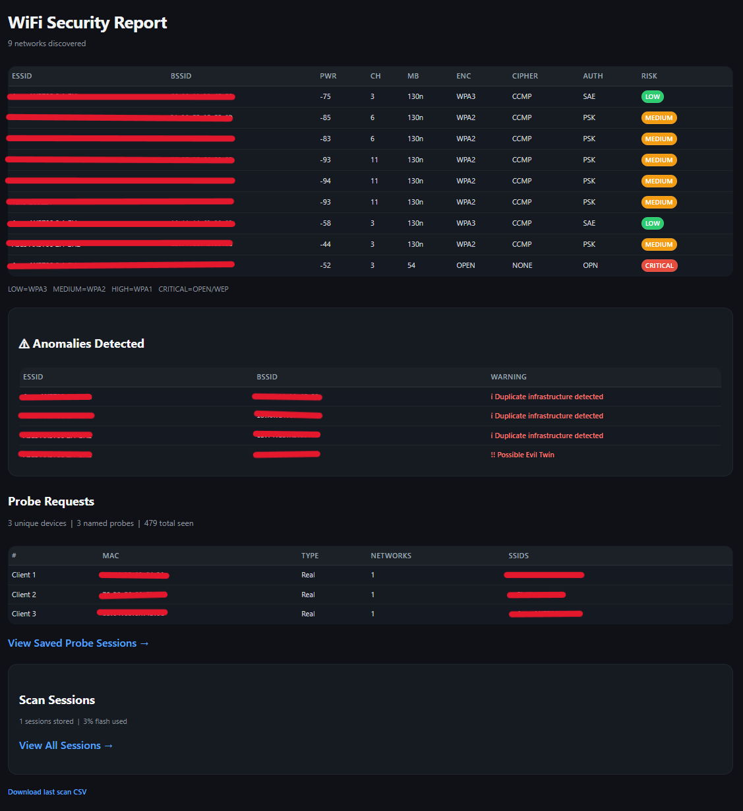

# WiFi Security Scanner

A portable passive wireless monitoring platform built on the Heltec Wireless Paper V1.2 (ESP32-S3).
Passively scans nearby WiFi infrastructure, captures 802.11 probe requests from client devices, classifies networks by security risk, detects wireless anomalies, and generates a full web report with CSV export over its own access point.

 
 

---

## Features

**WiFi Infrastructure Scanning**
- Passive WiFi scanning - no connection to any network
- Risk classification: LOW / MEDIUM / HIGH / CRITICAL
- Displays ESSID, BSSID, PWR, CH, MB, ENC, CIPHER, AUTH
- Scrollable summary list with cursor navigation
- Detail view per network with first seen timestamp
- Historical database tracking up to 200 unique BSSIDs across scans
- Background auto-scan every 20 seconds
- Session persistence - scan history saved to flash storage

**Anomaly Detection**
- Evil twin detection - suspicious networks sharing an ESSID with mismatched authentication
- Auth change detection - alerts when a network's security type changes between scans
- BSSID rotation detection - identifies duplicate infrastructure or unstable beacon identity
- Channel shift detection - tracks networks moving channels between scans

**Probe Request Telemetry**
- Passive 802.11 probe request capture using ESP32 promiscuous mode
- Named probe storage with up to 500 unique entries
- Wildcard `<any>` probe counting for RF activity density metrics
- Randomized MAC detection and client classification
- Adaptive channel survey — scores channels by AP density before sniffing
- Adaptive high-density channel prioritization
- Probe session persistence to flash storage (up to 200 sessions)

**Web Report**
- Full scan report at http://192.168.4.1
- Anomalies section highlights suspicious networks
- Probe requests grouped by client MAC, sorted by SSID count
- Managed device heuristics for clients probing 3+ networks
- Probe density statistics: unique devices / named probes / total frames seen
- Session history with per-scan anomaly counts
- Combined WiFi + probe CSV export
- Mobile-optimized dark-mode interface

**Hardware**
- Battery level indicator
- Deep sleep with wake-on-button
- E-ink display with fast partial refresh

---

## Web Report

When **Web Report** is selected from the menu:

1. The device creates a WiFi access point
2. Connect your phone or laptop:
   - SSID: `WiFi-Security-Scanner`
   - Password: `SetYourOwnPassword`
3. Open a browser and go to `http://192.168.4.1`
4. The full scan history is shown in an airodump-ng style table
5. If anomalies are detected, a dedicated **Anomalies Detected** section appears below the table
6. Probe requests are shown grouped by client device, sorted by number of known networks
7. CSV export links at the bottom let you download WiFi and probe data

> **Note:** Change `AP_SSID` and `AP_PASS` at the top of `HeltecWifiScanner.ino`
> before uploading to set your own network name and password.

### Anomaly Detection

The scanner passively monitors for suspicious network behaviour across scans:

| Flag | Severity | Description |
|---|---|---|
| Possible Evil Twin | !! | Network sharing an ESSID with conflicting authentication settings |
| Auth mode changed | ! | Network security type changed between scans |
| Channel shift | ! | Network moved channels between scans |
| Duplicate SSID | i | Multiple networks sharing the same name |
| Duplicate infrastructure | i | Multiple BSSIDs for the same ESSID (normal for mesh/extenders) |

---

## Probe Request Telemetry

The scanner captures 802.11 probe request frames passively using the ESP32 promiscuous mode receiver - without connecting to or interacting with any network.

Before entering capture mode, the scanner runs a quick channel survey scoring channels by AP density and RSSI weighting, then focuses on the top 3 busiest channels with adaptive 2 second dwell time per channel.

Captured probe data is grouped by client MAC in the web report, sorted by number of unique SSIDs observed per device. Devices probing for 3 or more networks are flagged as possible corporate or managed devices.

**Telemetry limitations worth knowing:**
- Modern iOS and Android devices send wildcard `<any>` probes rather than named SSIDs, so named probe counts will be much lower than total frame counts in most environments
- MAC address randomization is now standard on modern devices, which limits per-device attribution across sessions
- Probe telemetry is observational only - the scanner never transmits, associates or responds to any device

---

## Risk Classification

| Risk | Label | Encryption |
|---|---|---|
| 0 | LOW | WPA3, WPA2+WPA3 |
| 1 | MEDIUM | WPA2 |
| 2 | HIGH | WPA1 |
| 3 | CRITICAL | OPEN, WEP |

---

## Session Storage

Scan sessions and probe sessions are saved independently to flash (LittleFS) as ring buffers:

| Store | Capacity | Format |
|---|---|---|
| WiFi sessions | 200 sessions | `/sessions/s000.csv` |
| Probe sessions | 200 sessions | `/probes/p000.csv` |

Sessions can be cleared from the **Scan Sessions** screen (triple click). Flash usage is shown on both the device screen and in the web report.

---

## Technical Notes & Limitations

- **2.4GHz only** - the ESP32-S3 radio does not support 5GHz. Networks broadcasting exclusively on 5GHz will not appear.
- **MB is estimated** - link rate is inferred from auth mode, not read directly from beacon frames.
- **Named probe counts are environment dependent** - modern devices with MAC randomization and wildcard probing will show high total frame counts but low named probe counts. This is expected behaviour.
- **Probe data is not correlated across sessions** - randomized MACs make cross-session device tracking unreliable by design.

---

## Hardware

| Component | Details |
|---|---|
| Board | Heltec Wireless Paper V1.2 |
| Chip | ESP32-S3FN8 + SX1262 |
| Display | 250×122 e-ink |
| Button | GPIO0 (onboard) |
| Battery | Single cell LiPo 3.7V |

### Where to buy *(links verified May 2026)*

- **Board** - [Heltec Wireless Paper V1.2 on AliExpress](https://www.aliexpress.com/item/1005005698328124.html)
- **Battery (requires soldering, higher capacity)** - [LiPo battery on AliExpress](https://www.aliexpress.com/item/32956044089.html)
- **Battery (no soldering, lower capacity)** - [LiPo battery on eBay](https://www.ebay.com/itm/253599191104)

> Note: The board listing title may say 212×104 pixels - this is the same board.
> Make sure you select **V1.2** and not V1.1.

---

## Dependencies

Install via Arduino Library Manager:

| Library | Purpose |
|---|---|
| `heltec-eink-modules` | E-ink display driver |
| `Adafruit GFX Library` | Graphics primitives |
| `U8g2_for_Adafruit_GFX` | Font rendering |

---

## Arduino IDE Setup

1. Go to **File → Preferences → Additional Boards Manager URLs** and add:
   `https://github.com/Heltec-Aaron-Lee/WiFi_Kit_series/releases/download/0.0.5/package_heltec_esp32_index.json`
2. Go to **Tools → Board → Boards Manager**, search for **Heltec ESP32 Series Arduino Develop Environment** and install
3. Select board: **Heltec Wireless Paper V1.2**
4. Select port: **Tools → Port → COM3** (Windows) or **/dev/ttyUSB0** (Linux/Mac)
5. Install the three libraries listed above
6. Open `HeltecWifiScanner.ino` and upload

---

## Button Controls

| Screen | 1x click | 2x click | 3x click | Hold |
|---|---|---|---|---|
| Menu | Next item | Select | — | Sleep |
| Results | Cursor ↓ | Next page | Detail view | Menu |
| Detail | Back | — | — | Menu |
| Sessions | — | — | Clear all | Menu |
| Probe sniffer | — | — | — | Stop & menu |
| Web report | — | — | — | Stop & menu |

---

## Legal

This tool performs **passive scanning only**. It reads beacon frames that access points broadcast publicly, and probe request frames that client devices broadcast publicly. The same information your phone sees when searching for WiFi networks. It does not connect to, inject packets into, or capture data from any network.

Use only on networks you own or have explicit written permission to audit.

---

## Acknowledgements

Adapted from the [Pala One firmware](https://github.com/PaulLagier/pala-one-firmware)
by [Paul Lagier](https://github.com/PaulLagier) — button handling, battery measurement,
and deep sleep patterns. Check out his e-reader project, it is excellent!

---

## Case

The 3D printed case shown in the photos is from the Pala One project by Paul Lagier.
It fits the Heltec Wireless Paper V1.2 perfectly and is available for purchase here:

https://ko-fi.com/s/e14ed892ea

> Please check the specific specifications for the battery size and the printable
> case files to ensure compatibility before purchasing the hardware.
> Paul has a print for every battery mentioned in this project. It only depends
> on the style of the case, size, soldering or capacity.

---

## Author

Robert Russell

---

## License

See [LICENSE](LICENSE) for details.
